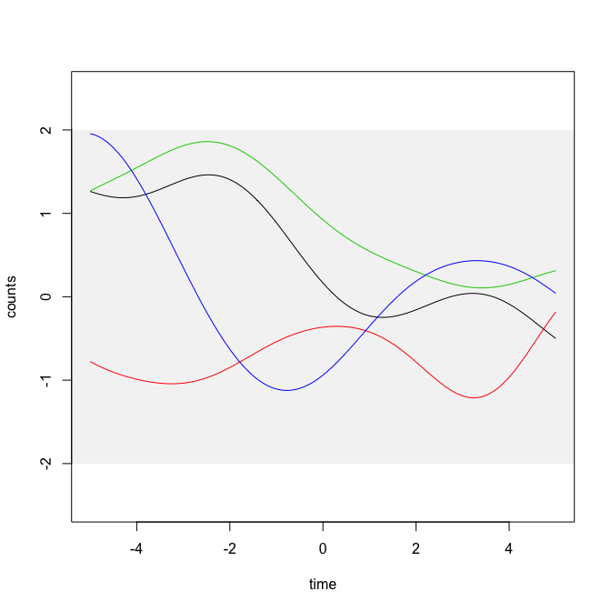
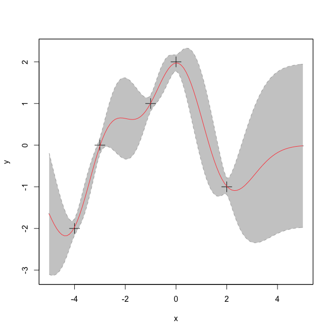
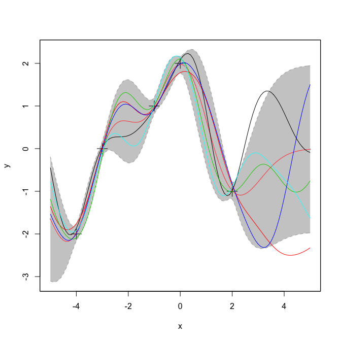

Gaussian Process Regression
================
Wajid Jawaid
2018-04-13

<!-- README.md is generated from README.Rmd. Please edit that file -->
[](http://www.repostatus.org/#active)

gpr
===

Gaussian Process Regression allows simple use of gaussian processes to fit optimum lines without choosing a specific function.

Example
-------

This is an example taken from Carl Rassmussen's book on Gaussian processes. We can first sample from the prior.

``` r
library(gpr)

d <- .1
x <- seq(-5,5,d)
K <- covMat(x, x, function(xx,xy) cf(xx,xy, l = 2))
L <- cholesky(K)

plot(NULL, xlim=c(-5,5), ylim=c(-2.5,2.5), xlab = "time", ylab = "counts")
rect(-6, -2, 6, 2, col="#44444411", lty=0)
for (i in 1:4) {
    y <- sampleFromL(L)
    points(x,y, pch=16, xlim=c(-5,5), ylim=c(-2,2), cex=.2, col = i, type = "l")
}
```



Now we can add data points (-4,-2); (-3,0); (-1,1); (0,2) and (2,-1). Now we can find the posterior distribution.

``` r
x <- c(-4,-3,-1,0,2)
y <- c(-2,0,1,2,-1)

pst <- predictGP(x, y, xs = seq(-5,5,.1), cvFunc = cf, sigman = 0.1, l = 1)
plot(pst, p.pch = 3, p.cex = 2, xlab = "x", ylab = "y")
```



Now we can sample from the new posterior.

``` r
plot(pst, p.pch = 3, p.cex = 2, xlab = "x", ylab = "y")
L <- cholesky(pst$cv)

for (i in 1:5) {
    yo <- sampleFromL(L, mu = pst$mean)
    points(pst$x,yo, pch=16, xlim=c(-5,5), ylim=c(-2,2), cex=.2, col = i, type = "l")
}
```


